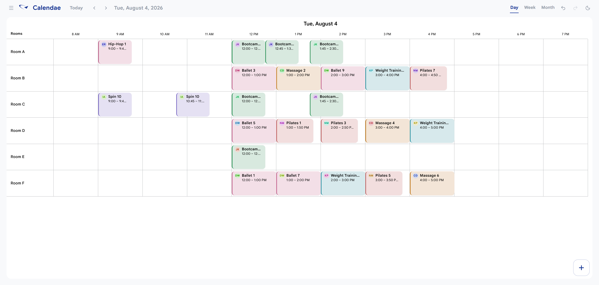

# Calendae



Calendae is a client-side scheduling workspace built to turn availability data from a large instructor team into a practical class schedule. It was designed around a real use case: helping coordinate schedules for 80+ instructors while balancing the rooms they prefer, their availability, and the availability of every room.

## How it works

1. Collect instructor responses in Cognito Forms, including their weekly availability, requested class types and frequencies, and preferred rooms.
2. Export the responses as an Excel workbook and import it into Calendae.
3. Generate a starting schedule. The allocator searches 15-minute slots and accounts for instructor availability, room conflicts, a one-hour buffer between an instructor's bookings, and preferred rooms before falling back to other suitable rooms.
4. Refine the result in the scheduler, then export the completed schedule or save the entire workspace for later.

The generated plan is a starting point rather than a black box: schedulers retain full control to review, move, resize, add, or remove events.

## Features

- Import instructor availability and class requests from a Cognito Forms Excel export
- Generate schedules across a selected date range
- Give preferred rooms priority while avoiding instructor and room conflicts
- Drag and drop events, resize their duration, and surface scheduling conflicts while editing
- Work in day, week, and month views
- Add, edit, or remove instructors, rooms, classes, availability windows, and individual events
- Customize class types and their colours
- Undo and redo schedule changes
- Export a flattened schedule to Excel
- Save and reopen the complete workspace as JSON, including rooms, instructors, class types, and events

## Privacy and data ownership

Calendae runs entirely in the browser. It has no backend or database: imported roster data and scheduling changes stay in the current browser session unless the user explicitly downloads a JSON or Excel export.

## Cognito Forms import format

The importer is configured for a Cognito Forms workbook with these sheets:

- `WeeklyInstructorAvailability` — instructor identity, preferred rooms, and submission status
- `AvailabilityBlock` — weekly availability entries
- `AvailabilityBlock2` — requested class types and weekly counts

Only submitted entries are imported. The expected form and column names are defined in [`src/lib/roster/parseRoster.ts`](src/lib/roster/parseRoster.ts) and can be adjusted if the Cognito form changes.

## Getting started

Prerequisites: Node.js 20 or later.

```bash
npm install
npm run dev
```

Open the local URL shown by Vite. For a production build:

```bash
npm run build
```

## Development commands

```bash
npm run dev     # Start the development server
npm run build   # Type-check and create a production build
npm run lint    # Run ESLint
npm test        # Run the test suite
```

## Tech stack

React, TypeScript, Vite, and SheetJS (`xlsx`).
